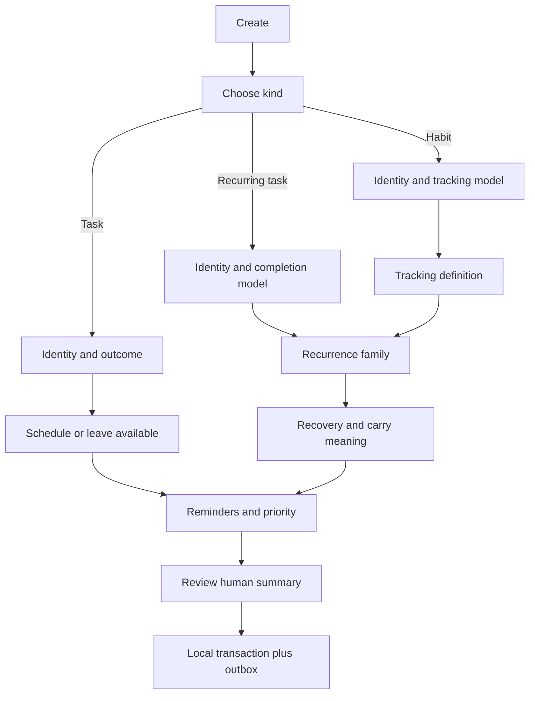

# HabitNow 2026 decision-flow decomposition

Status: complete visual evidence extraction
Original evidence root: `C:/Users/K1/Downloads/HabitNow`
Frozen in-repository evidence: `../references/habitnow-2026/manifest.md`
Captured: 2026-07-27
Use: logic and ergonomics only; no cosmetic copying

## Why this evidence matters

HabitNow's strongest behavior is not its visual style. It asks high-impact decisions
in a sequence that prevents incompatible fields from competing for attention. The
Perfect! wizard will preserve that dependency order, then improve clarity, draft
safety, responsive composition, editing and review.

## Screenshot inventory

All 25 original screenshots, exact hashes and the uncropped chronological contact
sheet are frozen in `../references/habitnow-2026/manifest.md`. The rows below record
the logic extracted from those files rather than replacing the visual evidence.

| File | Surface or decision | Extracted behavior |
| --- | --- | --- |
| `Screenshot_20260727_205812_One UI Home.png` | Android widget | Scrollable Today collection, date navigation, direct completion control and compact `+` Quick Add. |
| `Screenshot_20260727_205818.png` | Today | Horizontal date strip, search/filter/calendar/help and direct per-row state control. |
| `Screenshot_20260727_205822.png` | Habits | Habit cards, seven-day history/streak strip, completion percentage, calendar/statistics/menu. |
| `Screenshot_20260727_205826.png` | Tasks | Single/recurring segmentation and quick list scanning. |
| `Screenshot_20260727_205830.png` | Categories | Default/custom categories, entry counts, create and reset affordances. |
| `Screenshot_20260727_205834.png` | Timer | Stopwatch/countdown/interval modes, last record and optional activity association. |
| `Screenshot_20260727_205841.png` | Drawer | Secondary destinations: news, categories, timer, customization, settings, account and backups. |
| `Screenshot_20260727_205844.png` | Creation type | Explicit Habit / Recurring Task / Task fork before any dependent fields. |
| `Screenshot_20260727_205848.png` | Category step | Category choice first, plus inline custom category creation. |
| `Screenshot_20260727_205853.png` | Habit evaluation | Four tracking families: yes/no, numeric, timer and checklist. |
| `Screenshot_20260727_205901.png` | Numeric definition | At least/at most direction, goal, unit/day, description and additional goals. |
| `Screenshot_20260727_205905.png` | Timer definition | Time-based target definition. |
| `Screenshot_20260727_205910.png` | Checklist definition | Editable sub-items and success threshold of all or a custom count. |
| `Screenshot_20260727_205916.png` | Boolean definition | Minimal yes/no habit identity and description. |
| `Screenshot_20260727_205931.png` | One-off task editor | Category, date, reminders, checklist, priority, note and Pending behavior in one form. |
| `Screenshot_20260727_205937.png` | Task category picker | Reuses category selection outside the habit wizard. |
| `Screenshot_20260727_205940.png` | Recurring-task evaluation | Recurring work narrows tracking to yes/no or checklist instead of exposing habit-only numeric/timer branches. |
| `Screenshot_20260727_205951.png` | Recurrence family | Every day, specific weekdays, month days, year days, some days per period and repeat interval. |
| `Screenshot_20260727_205954.png` | Some days per period | `N` days per week/month/period is configured inline only after selection. |
| `Screenshot_20260727_205957.png` | Specific annual dates | Add one or more dates and optionally keep an incomplete item flexible. |
| `Screenshot_20260727_210001.png` | Specific month days | 1–31 and `Last`, with optional weekday interpretation and Flexible behavior. |
| `Screenshot_20260727_210004.png` | Specific weekdays | Multi-select weekday grid and Flexible behavior. |
| `Screenshot_20260727_210007.png` | Repeat interval | Every `N` days, Flexible carry and alternate-day behavior. |
| `Screenshot_20260727_210010.png` | Schedule and safeguards | Start/end date, time/reminders and priority after recurrence is known. |
| `Screenshot_20260727_210025.png` | Calendar picker | Month navigation, selected/today states and explicit Close/Today actions. |

## Canonical dependency graph

## What Perfect! keeps

1. **Type before dependent fields.** Type exists only during creation. Editing an
   existing entity never asks an immutable type question.
2. **Tracking method before target.** The owner chooses what success means before
   seeing method-specific inputs.
3. **Recurrence family before parameters.** Only the selected branch reveals its
   days, interval, range or exceptions.
4. **Schedule safeguards last.** Start/end, reminders, quiet hours and priority are
   easier to reason about once recurrence is concrete.
5. **Direct list/widget logging.** Common outcomes remain one gesture away.

## What Perfect! improves

### Named adaptive steps

Use meaningful labels rather than dots:

1. Meaning
2. Measure
3. Rhythm
4. Recovery
5. Remind
6. Review

The visible sequence shortens when branches are irrelevant. On phone it is a compact
step title and progress phrase; tablet/Windows can show the semantic outline without
turning it into a wide permanent sidebar.

### Live summary rail

Every choice updates a plain-language contract such as:

> Read at least 20 pages, three days each week. Incomplete sessions stay Pending
> until the next valid day; carry is capped at two. Remind at 20:00 unless quiet
> hours are active.

The summary is the primary error detector. Impossible combinations are explained in
context, not saved as a generic validation error at the end.

### Draft continuity

- Draft is written locally after every meaningful change.
- Back never discards silently.
- Phone IME, rotation, tablet split-screen and Windows resize preserve step,
  selection, scroll and focus.
- Closing offers Continue later / Discard with the exact entity title and impact.
- Quick Capture can later open the wizard with title and parsed hints already
  populated, but it remains a valid saved local task even if enrichment stops.

### Edit without false mutability

- Normal row tap opens detail/history.
- Edit is explicit from detail or a named row action.
- Existing Task/Recurring/Habit type is shown as a read-only fact, not Step 1.
- Tracking-model conversion, when safe, is a guarded migration flow with a preview
  of historical consequences; otherwise it is absent.

### Recovery as a first-class semantic choice

Each recurring task or habit can choose:

- Miss;
- remain Pending;
- carry to next valid occurrence;
- ask the owner;
- automatic next-valid transfer;
- bounded carry cap.

The review step shows the exact effect on streaks, history, reminders and tomorrow's
load. This is not hidden under `Advanced` because it changes the truth of the plan.

### Logging ergonomics by tracking method

| Method | Fast control | Correction | Dense-day behavior |
| --- | --- | --- | --- |
| Boolean | tap cycles empty -> done -> missed -> empty | long press or detail history | stable circular control; no redundant check beside selected color |
| Count | large `+1`, optional minus, rapid-tap serialization | tap value for exact set | target ring around control; no cramped percentage text |
| Duration | quick preset or start timer | exact duration edit | running state remains visible across navigation/background |
| Numeric | quick add chips plus exact set | unit-aware entry | actual/target text may stack below title at narrow widths |
| Checklist | tap next step or expand | individual item history | progress arc plus remaining count; sub-items lazy-expand |
| Quit habit | log avoided/incident/urge | append correction with reason | non-guilt language; trend and recovery replace punitive streak loss |

## Rejected direct imitation

- black full-screen styling, cyan brand color and legacy Material controls;
- title/category as separate isolated pages when a composed Meaning step is faster;
- tiny text, weak focus states and scroll-dependent discovery of the active branch;
- configuration controls with no human-readable recurrence/recovery consequence;
- different component systems for Habit, Recurring Task and Task.

## Verification obligations inherited by later stages

- Every branch above must appear in the component/page preview registry.
- Create and edit paths must have separate compositions and tests.
- Every recurrence must round-trip through local DB, outbox, Supabase, AI proposal,
  widget/notification projection and human-readable summaries.
- Rapid habit logging must be serialized and reversible offline.
- No example entity from these screenshots may enter a signed owner build.
