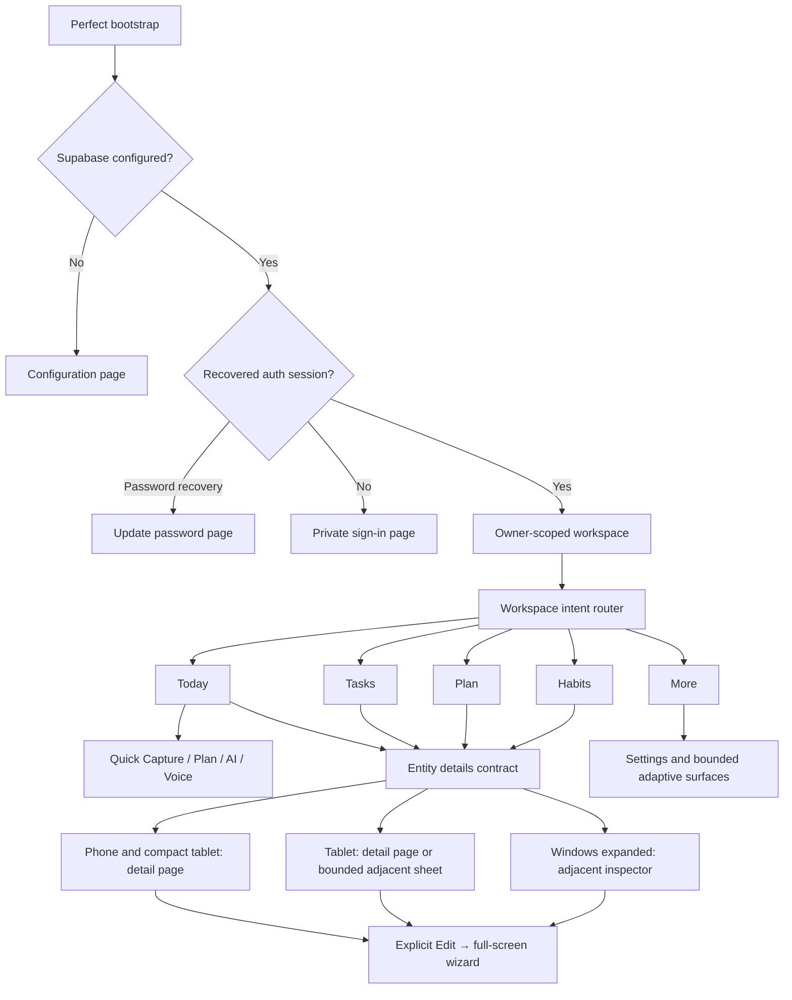
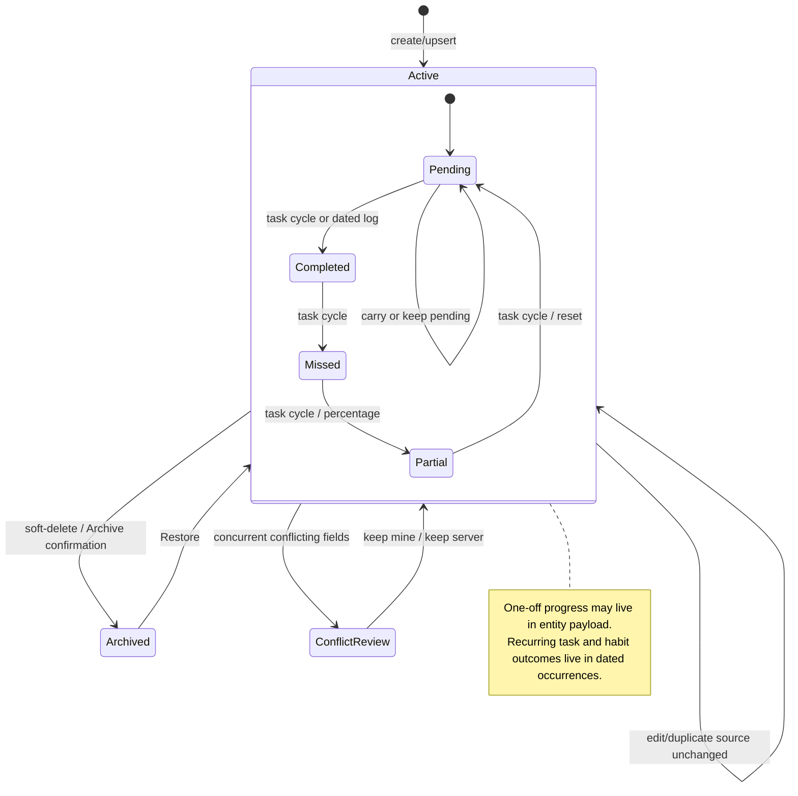
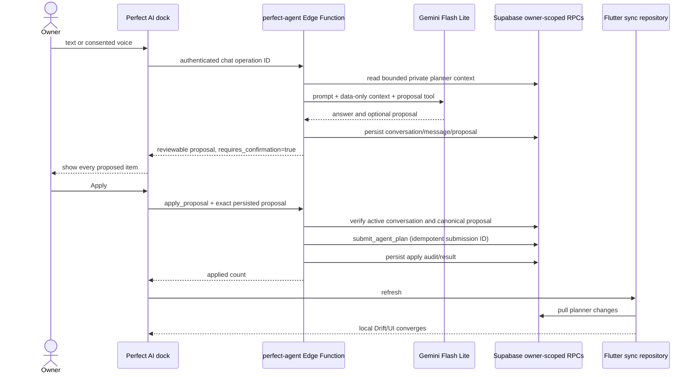
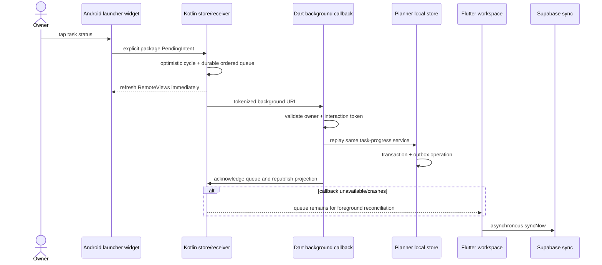

# Stage 02 evidence — interaction, route and mutation inventory

Status: locally complete; exact-SHA hosted verification follows the Stage 02 push
Inventory snapshot: product sources at Stage 01 commit `e0840c1`; workflow-only transport fix `eaad6b2` changes no mapped route
Prepared: 2026-08-09
Platforms: Flutter Android phone/tablet and Flutter Windows only

## 1. Decision frozen by this stage

Perfect! has one view-first interaction hierarchy:

1. Tapping the body of a Task or Habit opens its information/history surface.
2. A status control changes only the current outcome or log.
3. Edit is an explicit command from details, a named context action, or a
   clearly labelled edit affordance.
4. Create flows and Quick Capture are the only intentional direct-to-editor
   entries.
5. Native notification/widget ingress resolves through the same workspace
   intent router and the same entity-detail owner as foreground taps.

The current product does not fully satisfy this decision. Those deviations are
catalogued below rather than normalized as desirable behavior.

## 2. Evidence boundary and method

The inventory was built from source, not screenshots:

- Flutter shell and callbacks: `lib/main.dart` and
  `lib/presentation/perfect_workspace_page.dart`.
- Full editor: `lib/presentation/planner_editor.dart`.
- Adaptive surfaces: every `*_sheet.dart` under `lib/presentation`.
- AI: `lib/ai/perfect_ai_dock.dart`, `perfect_ai_client.dart`, the
  `perfect-agent` Edge Function and agent-plan migration.
- Mutations: `PlannerWorkspaceController` → `PlannerLocalStore` →
  `PlannerSyncRepository` → `apply_planner_mutation`.
- Android widget: manifest, provider, collection factory, action receiver,
  quick-add activity and Dart background callback.
- Notifications: `planner_reminder_scheduler.dart` on Android and Windows.
- Feedback: `lib/feedback/src/feedback_overlay.dart` and its controller.
- Characterization: existing workspace, widget, reminder, AI, sync and local
  store tests plus the Stage 02 contract test.

The worktree already contained unaccepted Quick Capture/date/test prototypes.
They were not staged or treated as accepted behavior. Route methods were checked
against `git show HEAD:...`; the known dirty changes do not alter `_inspect`,
`_navigateToEntity`, `_selectDestination` or the native ingress owners.

## 3. Application and route tree



### 3.1 Form-factor composition

| Layout class | Navigation owner | Destination surface | Entity body tap — current | Entity body tap — canonical | Capture/AI |
|---|---|---|---|---|---|
| Compact `<640` | Glass footer | One destination at a time | Opens `PlannerEditor` directly | Pushes detail page | Today only, above footer |
| Medium `640–1279` | Collapsible tablet rail | One destination at a time; Today uses medium deck | Opens `PlannerEditor` directly | Detail page/bounded detail surface | Today only, in content column |
| Short landscape `<520h` | Collapsible short rail | Medium composition | Opens `PlannerEditor` directly | Bounded detail page/surface | Today only; must survive IME |
| Expanded `>=1280` | Persistent collapsible Windows rail | Today three-part deck; other pages may add inspector | Opens adjacent inspector when enough width | Adjacent inspector by the same detail contract | Today only, in content column |
| Expanded but insufficient adjacent width / large type | Windows rail | Inspector is suppressed | Selection is retained but no replacement detail route appears | Full detail page or overlay fallback | Today only |

The last row is a real reachability gap: `showAdjacentInspector` can become false
while `_inspected` remains non-null, leaving the selected entity without a visible
detail surface.

## 4. Complete Flutter surface inventory

Every surface below has a named owner. “Mutation” means a durable product write,
not transient selection or animation state.

| ID | Trigger / precondition | Current destination | Mutation and confirmation | Success / error behavior | Return-state contract |
|---|---|---|---|---|---|
| APP-01 | Process launch | Owned bootstrap surface | None | Configuration/bootstrap failure becomes owned screen | Theme read and auth recovery continue asynchronously |
| APP-02 | Missing/invalid build-time Supabase config | `ConfigurationPage` | Device connection config; explicit Connect | Inline error; no planner data touched | App switches to authenticated shell after valid init |
| AUTH-01 | No recovered session | `AuthPage` | Supabase password sign-in | Inline success/error; session stream owns transition | Session persists across normal app updates |
| AUTH-02 | “Forgot password” | Recovery email request | Supabase auth side effect | Inline delivery/error copy | Returns to sign-in surface |
| AUTH-03 | “Change this device’s connection” | Confirmation dialog → configuration | Confirmation required; no planner wipe | Keeps current connection on cancel | Auth shell is disposed only after approval |
| AUTH-04 | Password-recovery auth event | `UpdatePasswordPage` | Supabase password update | Inline message | Auth stream returns to normal session surface |
| NAV-01 | Footer/rail/Ctrl+1 | Today | None | Destination motion | Clears inspector; Today owns composer |
| NAV-02 | Footer/rail/Ctrl+2 | Tasks | None | Destination motion | Current implementation recreates local filter state |
| NAV-03 | Footer/rail/Ctrl+3 | Plan | None | Destination motion | Current implementation recreates selected day |
| NAV-04 | Footer/rail/Ctrl+4 | Habits | None | Destination motion | Habit list is recomputed from controller |
| NAV-05 | Footer/rail/Ctrl+5 | More | None | Destination motion | Leaving Today closes AI |
| SYNC-01 | Header cloud tap | Bounded sync details dialog | Retry invokes `controller.refresh` | Spinner, last-success/error detail | Local workspace remains usable |
| CAP-01 | Today capture orb or Ctrl+K | Inline expanded Quick Capture | Title submit → `quickCapture`; double submit guarded | Local commit then async sync; draft retained on failure | Text controller survives breakpoint; mode does not |
| CAP-02 | Plan command inside capture | Full-screen `PlannerEditor` | No write until save | Wizard owns validation/errors | Prior workspace focus restored on close |
| AI-01 | Perfect AI command | Inline AI dock | Chat persists conversation; no planner write | Retry/cancel/error ribbon | Hydrates latest remote conversation |
| AI-02 | Voice command | AI dock + consent dialog | Records only after consent | Permission and preparation errors are owned | Clip stays local until submit/removal |
| AI-03 | Reviewable proposal | Proposal preview inside dock | Apply requires persisted matching proposal | Applied count + refresh; safe proposal remains on failure | Remote conversation/audit can rehydrate |
| EDIT-01 | Create/Add/Ctrl+N/explicit Edit | Full-screen multistep wizard | `saveEntity`; no separate confirmation | Validation keeps draft; local failure keeps route open | Resize preserves draft; system Back is not guarded |
| FOCUS-01 | Context, inspector, More, Ctrl+Shift+F | Dialog on wide; bottom sheet on compact | Start/complete/cancel focus session | Local session/outbox; errors remain in surface | Active session can be restored |
| HABIT-01 | Habit leading control, status chip, Log button | Dialog on wide; bottom sheet on compact | Dated habit occurrence; Save required | Explicit retry/error; saved summary refreshes | Day draft warns only when switching day |
| RECOVERY-01 | Decision-needed chip/context action | Dialog on wide; bottom sheet on compact | Pending/carry/missed; choice is confirmation | Local result/snackbar; failure keeps prior state | Closes after successful choice |
| PROGRESS-01 | “Set today’s percentage” | Dialog on wide; bottom sheet on compact | Recurring occurrence partial percent; Save required | Safe failure snackbar | Closes after success |
| ARCHIVE-01 | Archive context action | Named confirmation dialog | Soft-delete tombstone; explicit confirmation | Failure says nothing changed | Inspector/list update from local watch |
| ARCHIVE-02 | More → Archive | Adaptive archive surface | Restore action | Snackbar/failure and reload | Returns to archive surface |
| INSIGHT-01 | More → Insights | Adaptive insight surface | Read-only range switch | Retry and owned failure | Range is local to surface |
| REMIND-01 | More → Reminders | Adaptive settings surface | Permission/settings/schedule writes | Summary includes denied/skipped/failure/truncation | Device-local settings retained |
| WIDGET-01 | More → Today widget | Adaptive widget settings | Title privacy toggle / pin request | Pin result snackbar | Device-local setting retained |
| CONFLICT-01 | More → Conflicts | Adaptive conflict center | Keep server or keep mine | Busy per conflict; failure preserved | Refreshes remaining conflicts |
| FEEDBACK-01 | More → Capture feedback | Bottom menu | None until draft saved | Screenshot failure does not save partial entry | Returns to workspace after action choice |
| FEEDBACK-02 | Screenshot/note choice | Draft dialog | Save private local entry | Failure snackbar; draft otherwise retained in dialog | Closes after successful save |
| FEEDBACK-03 | More → captured entries | Bottom sheet | Delete one, export, clear, recover | Explicit destructive/export/recovery dialogs | Reloads list after each operation |
| FEEDBACK-04 | Entry tap | Detail dialog | Read-only | Missing screenshot is explained | Returns to entries sheet |

## 5. Entity-row interaction matrix

All list bodies eventually use `_AgendaRow`, `_ReferenceAgendaRow` or
`_HabitCard`; therefore their callback ownership is the critical route seam.

| Page / row | Body tap | Leading status | Inline secondary control | Touch overflow | Mouse / long press / keyboard context |
|---|---|---|---|---|---|
| Today compact reference task | `_inspect` → currently editor | Cycles pending → done → missed → partial → pending | Recovery chip opens recovery | Reference row has no touch overflow | Right-click/long-press/Context key/Shift+F10 opens full context menu |
| Today standard task | `_inspect` → inspector or editor | Same serialized cycle | Recovery chip; recurring percentage via menu | Details, duplicate, tomorrow/recovery/miss/percent/focus/archive | Full context menu also includes explicit Edit |
| Tasks task | `_inspect` → inspector or editor | Same cycle | None unless source qualifies | Details, duplicate, task actions, archive | Full context menu |
| Plan task | `_inspect` → inspector or editor | Same cycle | None unless source qualifies | Details, duplicate, task actions, archive | Full context menu |
| Today/Plan habit in agenda row | `_inspect` → inspector or editor | Opens full habit log; does not inline +1 | Summary chip opens full log | Details, duplicate, miss/focus/archive | Full context menu includes Log/Correct |
| Habits card | Title area only calls `_inspect` | No leading outcome control | Log/Edit Today button and status band open full log | No three-dot button | Full context menu |
| Expanded inspector | N/A | Read-only facts | Explicit Edit, Duplicate, Focus | N/A | Normal focus traversal |

### 5.1 Context action ownership

The desktop/keyboard context menu supports: Open details, Edit, Duplicate,
Log/Correct habit, Resolve recovery, Set percentage, Mark miss, Start focus,
Move tomorrow and Archive. The touch `PopupMenuButton` omits explicit Edit even
though body tap already edits on compact layouts. This is not a coherent action
model; it is migration debt `IR-008`.

## 6. Native and external entrypoints

| ID | Native trigger | Wire/intent | Preconditions | Current owner and result | Failure/replay |
|---|---|---|---|---|---|
| AND-01 | Widget brand/header/footer tap | `perfect://planner/today` | Widget installed | `HomeWidgetLaunchIntent` → `showToday` | Invalid URI ignored |
| AND-02 | Widget task control | Package-local mutable PendingIntent + entity/action extras | Current-day projected task | Native optimistic cycle → queue → Dart background | Queue survives process/callback failure |
| AND-03 | Widget Quick Add | Explicit immutable activity PendingIntent | Owner/token projection exists | Compact native activity; title optionally time | Signed-out state opens app; request replay is idempotent |
| AND-04 | Widget resize | AppWidget options / Android 12 responsive map | Widget host | small/tall/wide/large native RemoteViews | Periodic refresh is backstop |
| AND-05 | Day rollover/time/timezone/package replacement | Alarm/receivers | Widget exists | Tokenized background refresh | Stale rows hidden until fresh projection |
| NOTE-01 | Notification body tap | `planner:<entityId>` payload | Notification plugin initialized | `PlannerReminderNavigation` → `showEntity` | Pending process-local ID consumed after workspace starts |
| NOTE-02 | Snooze action | Encoded snooze action ID | Permission and plugin available | Reschedules same payload | On reschedule failure, opens target instead |
| WIN-01 | Windows toast body/action | Same plugin payload/action | Packaged identity for reliable toast lifecycle | Same process-local reminder bridge | Launch detail support depends on plugin callback |
| WIN-02 | `perfect:` protocol activation | MSIX protocol registered | Packaged Windows install | Currently used by Supabase auth callback only; no workspace planner URI parser | Planner protocol launch is unowned debt `IR-011` |

Security boundaries:

- Widget task/quick-add background URIs require owner match and a constant-time
  token comparison before Drift opens.
- Android collection task PendingIntent is explicit/package-local.
- The widget never writes SQLite from Kotlin; Dart replays through the same local
  store/outbox services as the foreground app.
- Notification entity IDs are not authorization; the owner-scoped local store is
  still the data boundary.

## 7. Windows keyboard and pointer contract

| Trigger | Current action | State/guard |
|---|---|---|
| Ctrl+N | Open create wizard | `_editorSurfaceOpen` prevents duplicates |
| Ctrl+1…5 | Today/Tasks/Plan/Habits/More | Direction drives shared-axis motion |
| Ctrl+K | Expand and focus Quick Capture | Draft/focus restored across breakpoint |
| Ctrl+Shift+F | Focus surface | Uses inspected focusable entity when present |
| Escape | AI → inspector → capture → keyboard, in that priority | Editor/focus route owns its own Escape handling |
| Right click | Entity context menu at pointer | Focus is moved to row first |
| Long press | Entity context menu | Same action owner as mouse |
| Context Menu key / Shift+F10 | Entity context menu | `FocusableActionDetector` and semantics action |
| Rail collapse | Toggle tablet/desktop rail | Windows persists; tablet is in-memory only |

## 8. Entity lifecycle

Task entity lifecycle and dated outcomes are deliberately separate. A recurring
task or habit is not “completed forever” when one day succeeds.



## 9. Mutation traces

| User job | Presentation owner | Controller call | Atomic local write | Outbox target | Remote boundary | UI refresh |
|---|---|---|---|---|---|---|
| Quick task | Quick Capture | `quickCapture` | `createQuickTask` | entity | `apply_planner_mutation` | Drift entity watch + Today widget publish |
| Create/edit | Wizard | `saveEntity` | `upsertEntity` | entity | same RPC | watch + reminder refresh |
| Duplicate | Context/inspector | `duplicateEntity` | `upsertEntity` with fresh ID | entity | same RPC | watch; reveal duplicate |
| Archive | confirmation | `archiveEntity` → `deleteEntity` | `softDeleteEntity` | entity tombstone | same RPC | active watch removes item |
| Restore | archive surface | `restoreEntity` | restore entity | entity | same RPC | active watch restores item |
| One-off outcome | task control | `cycleTaskProgress` | entity progress patch | entity | same RPC | serialized result + haptic/semantics |
| Recurring outcome | task control/percent | `setTaskProgress` | dated occurrence | occurrence | same RPC | projection/widget/reminders |
| Habit log | habit log surface | `logHabit` / `undoHabitDay` | dated occurrence | occurrence | same RPC | Today/habit summary projection |
| Recovery | recovery surface | `resolveOneOffRecovery` | entity + recovery metadata | entity | same RPC | projection/widget/reminders |
| Focus | focus surface | `beginFocus` / `completeFocus` | focus session | focus session | same RPC | active session and insights |
| Conflict | conflict center | keep local/server | local conflict resolution/rebase | target-specific | retry/apply remote projection | conflict list refresh |
| AI proposal | AI dock | Edge Function apply | server `submit_agent_plan` | server planner operations/changes | authenticated RPC | client `refresh` pulls changes into Drift |

### 9.1 Local-first foreground sequence

```mermaid
sequenceDiagram
    actor Owner
    participant UI as Flutter control
    participant C as Workspace controller
    participant L as Drift local store
    participant O as Local outbox
    participant S as Sync repository
    participant R as Supabase RPC

    Owner->>UI: tap / submit
    UI->>C: typed intent
    C->>L: mutate owner-scoped data
    activate L
    L->>L: one SQLite transaction
    L->>O: append idempotent operation
    L-->>C: mutation receipt
    deactivate L
    C-->>UI: local success
    L-->>UI: reactive entity/projection update
    C->>S: unawaited syncNow
    S->>R: pull → push one op → pull
    alt acknowledged
      R-->>S: revision + snapshot
      S->>L: ack, rebase, apply projection
    else conflict
      R-->>S: conflict paths + snapshot
      S->>L: record conflict, preserve pending local
    else offline/error
      S->>L: increment retry metadata
      S-->>UI: yellow/red/offline state; local data remains
    end
```

### 9.2 AI proposal sequence



AI is intentionally server-write-then-pull rather than a client local-first
mutation. The review/persisted-proposal/idempotency checks are the compensating
safety boundary.

### 9.3 Android widget action sequence



Quick Add follows the same sequence except the native dialog first enqueues a
title/optional time request and Dart calls `createQuickTask` with the native
request ID as its mutation ID.

## 10. Interaction-cost baseline and target budgets

Counts are minimum deliberate taps/clicks after the relevant page is visible;
typing characters is listed separately. They are source-walk baselines and will
be timed again in real phone/tablet/Windows runtime during implementation.

| Core job | Current minimum | Current friction | Stage target |
|---|---:|---|---:|
| 1. Quick task | Phone: 3 + typing; Windows: Ctrl+K, typing, Enter | Orb opens but field needs a separate tap; current expanded shell repeats capture labels | Phone: 2 + typing; Windows unchanged |
| 2. Scheduled one-off task | ~11 + typing | Six wizard steps; scheduling invokes date and time pickers separately | ≤6 + typing with smart defaults and progressive detail |
| 3. Recurring task | ~13 + typing | Seven steps and recurrence is separated from outcome/recovery context | ≤8 + typing |
| 4. Habit | ~12–15 + typing | Seven steps; measure/definition/rhythm require repeated navigation | ≤9 + typing while retaining full power |
| 5. Add +1 to count habit | 3 | Open log, increment, Save | 1 inline; full log remains available |
| 6. Correct a habit day | 3–6 | Open full log, possibly navigate date, adjust, Save | Today: 2; historical day: ≤4 |
| 7. Complete / cycle task | 1 per state transition | Four-state cycle is fast but accidental overshoot has no direct chooser | 1 for next state; hold/secondary gives direct chooser |
| 8. View personal stats | More → Insights = 2; entity stats unavailable | Global insight is detached from item details | Item: 1 body tap; global: ≤2 |
| 9. Edit an item | Compact: 1 but violates view-first; expanded: body + Edit = 2 | Compact conflates view and edit | 2 through details; explicit context Edit remains 2 |
| 10. Ask Perfect AI | 4 + typing | Capture orb → AI → composer → send; surface competes with capture state | 2–3 + typing via one morphing composer |

## 11. State continuity audit

| State | Current behavior | Verdict / required owner |
|---|---|---|
| Auth session across update | Supabase session recovery; no app-data reset | Preserve and prove again at Stage 50 |
| Today scroll | PageStorage keys on Today compositions | Preserve |
| Tasks scroll | `perfect-tasks-scroll` key | Preserve |
| Tasks search/filter/kind/expanded deck | Local `_TasksPageState`; page replacement recreates it | Must move to destination state owner |
| Plan selected day | Local `_PlanPageState`; page replacement recreates it | Must persist for workspace session |
| Plan scroll | No explicit scroll key | Must preserve |
| Quick Capture text | Controller lives at workspace level | Preserve |
| Quick Capture expanded/mode state | Local dock state; leaving Today destroys it | Preserve draft; intentionally collapse mode only by explicit contract |
| Quick Capture focus across breakpoint | Explicit post-frame focus restoration | Preserve and regression-test |
| AI remote messages/proposal | Hydrated from owner-scoped server history | Preserve |
| Unsent AI composer text/voice clip | Local dock state; leaving Today closes/destroys it | Preserve text draft; voice clip needs explicit privacy expiry |
| Wizard draft on resize | Route state survives responsive recomposition | Preserve |
| Wizard draft on Back/system pop | No `PopScope`/dirty-draft confirmation | Add dirty-draft guard/autosave policy |
| Wizard during save | Buttons/Escape disabled, but system route pop is not guarded | Block pop until transaction resolves |
| Habit-log draft when changing day | Explicit discard confirmation | Preserve |
| Habit-log draft when closing | No dirty-pop guard | Add consistent guard |
| Expanded inspector selection | `_inspected` stores an entity object | Replace with entity ID and re-resolve reactively |
| Remote archive while detail open | Stale entity object can remain visible | Detail becomes unavailable/archived state without reviving stale data |
| Entity deep link before ready | Deferred until controller ready | Preserve |
| Entity absent at first lookup | Request serial is marked handled before lookup succeeds | Retry after pull or show unavailable state; do not silently drop |
| Windows rail width | Persisted in preferences | Preserve |
| Tablet rail width | In-memory only | Keep per-session; persistence optional by product rule |
| Sync/error state | Reactive notifier and bounded retry | Preserve; route to details consistently |
| Widget action/quick-add | Durable native queue + idempotent mutation IDs | Preserve |

## 12. Adversarial findings

| ID | Priority | Source-backed finding | Consequence | Planned owner |
|---|---|---|---|---|
| IR-001 | P0 | `_inspect` opens `PlannerEditor` on compact/medium | Body tap mutates navigation intent from “view” to “edit” | Stages 31 and 35 |
| IR-002 | P0 | Touch “Open details” calls the same `_inspect` path | Copy promises a detail surface that does not exist | Stages 31–35 |
| IR-003 | P1 | Existing editor still starts with Type while type cards are disabled | Wasted first step and apparent broken control | Stage 25 |
| IR-004 | P1 | Navigation serial is consumed before a missing entity can arrive from sync | Reminder/deep link can disappear silently | Stage 35 |
| IR-005 | P1 | Inspector stores a stale `PlannerEntity` object instead of entity ID | Remote edits/archive can leave stale facts/actions | Stages 31, 35, 42 |
| IR-006 | P1 | Tasks filters/search, Plan date and unsent AI draft are surface-local | Normal navigation loses user context | Stages 07, 19, 36, 37 |
| IR-007 | P1 | Every habit increment opens the full log and requires Save | Multiple-per-day habit UX is unnecessarily expensive | Stages 14, 28, 30 |
| IR-008 | P1 | Touch overflow omits Edit; desktop context includes it | Input modality changes the action vocabulary | Stages 13, 31 |
| IR-009 | P2 | Four-state task control exposes only the next action, not a direct state menu | Correction after overshoot costs extra taps | Stage 13 |
| IR-010 | P1 | Wizard and habit log have no consistent dirty/system-pop guard | Accidental back can discard meaningful input | Stages 21, 25, 30 |
| IR-011 | P2 | Windows registers `perfect:` but workspace planner URIs have no Windows parser | External planner link activation is unowned | Stage 35 |
| IR-012 | P2 | Duplicate reveals via `_inspect`; compact therefore opens duplicate in Edit | Duplicate feedback differs by form factor | Stages 31, 34 |
| IR-013 | P2 | Sign out is a direct More button with no confirmation | Accidental tap causes avoidable re-login friction | Stage 43 |
| IR-014 | P2 | Widget success/empty copy still says “orbit” although Orbit is retired | Product language drifts from new Today model | Stages 11, 48 |
| IR-015 | P2 | Expanded inspector can be suppressed by width/type scale with no detail fallback | Selected entity has no visible result | Stages 31, 35 |

No finding authorizes destructive migration or data reset. All route repairs are
presentation/coordinator changes over the preserved owner-scoped data model.

## 13. Canonical route and action owners

| Job | Current owner(s) | Canonical owner | Migration rule |
|---|---|---|---|
| Open entity | `_inspect`, `_navigateToEntity`, row/context callbacks | `WorkspaceIntentRouter.openEntity(id)` + shared `EntityDetailCoordinator` | Always pass ID, resolve live entity, choose page/inspector by layout without changing action meaning |
| Edit entity | Body tap on compact, inspector Edit, context Edit | `EntityEditCoordinator.open(id)` | Remove body-tap edit; retain named Edit only |
| Create entity | Page Add, Ctrl+N, capture Plan, empty states | `EntityCreateCoordinator.open(initialKind)` | Create remains direct wizard entry |
| Quick task | Quick Capture and widget activity | `QuickCaptureCoordinator` | Same validation/mutation contract for Flutter/native |
| Task outcome | Agenda controls and widget | `TaskOutcomeController` | One next-state tap; direct chooser for correction; idempotent absolute outcomes |
| Habit outcome | Agenda controls, cards, log sheet | `HabitLogCoordinator` | Inline method-specific action plus full correction surface |
| Recovery | Row chip and context | `RecoveryCoordinator` | Same bounded surface and feedback everywhere |
| Focus | Context, inspector, More, shortcut | `FocusCoordinator` | One surface guard; selected entity resolved by ID |
| Native reminder/widget route | Main scope subscriptions | `WorkspaceIntentRouter` | Queue until auth/local pull settles; show unavailable state if target is gone |
| AI chat/write | Quick composer + AI dock | `AiConversationCoordinator` / `AiProposalCoordinator` | Preserve explicit review and server audit; never direct-write without Apply |
| Settings surfaces | More callbacks | `OwnerSettingsRouter` | Adaptive presentation may differ; action semantics may not |

## 14. Characterization and executable coverage

Existing tests already freeze the useful behavior that must survive visual
replacement:

- workspace destinations, Today deep link, desktop entity navigation, stale-ID
  no-op, focus restoration and keyboard context access;
- local task outcome serialization and four-state cycle;
- widget URI validation, native queue replay and Quick Add;
- notification cold/live payload navigation and snooze;
- AI confirmation guard, proposal apply and history hydration;
- local outbox/retry/conflict behavior and owner isolation.

Two existing workspace tests explicitly characterize the undesirable compact
direct-to-editor behavior (`compact task details open the existing editor` and
the retained compact entity navigation test). They are evidence of current state,
not the target contract. Stage 31 must replace those expectations with shared
detail-route assertions in the same change that removes the behavior.

`test/presentation/interaction_route_inventory_contract_test.dart` adds
cross-layer static contracts without freezing the known defect:

1. every required diagram, core job and finding ID remains present;
2. all 27 whole-product coverage-ledger rows stay classified;
3. native reminder/widget ingress remains centralized;
4. foreground writes remain local-first and sync stays asynchronous;
5. AI applies only an exact persisted confirmation;
6. widget actions retain a durable idempotent replay route;
7. view-first intent remains explicit without approving compact direct-to-edit.

## 15. Whole-product coverage-ledger classification

Stage 02 changes documentation and characterization only. `changed + proved`
below means the consumer's route/interaction contract was added to this evidence;
it does not claim runtime behavior was already rebuilt.

| Product system | Stage 02 classification | Evidence / reason |
| --- | --- | --- |
| Boot, splash, configuration and private sign-in | checked unchanged | Initialization ordering and auth-gated native ingress inspected; no boot/auth source changed |
| Installed brand, typography, icon and platform identity | checked unchanged | Identity is outside a route-only stage and no asset/package source changed |
| Responsive shell, header, footer and rail | changed + proved | Form-factor route tree, rail/footer owners, shortcuts and resize hazards mapped |
| Sync cloud, dual date/time and ambient state | checked unchanged | Sync initiation/feedback ownership traced; visual/date behavior not changed |
| Today orientation and day stream | changed + proved | Today row taps, status/log controls, composer and navigation entrypoints mapped |
| Task row, progress and status cycle | changed + proved | Touch/mouse/keyboard/context/status matrix and correction friction mapped |
| Habit logging and streak state | changed + proved | Habit open/log/increment paths and expensive +1 flow mapped |
| Quick Capture/Plan/AI/Voice instrument | changed + proved | Entry, focus/draft continuity and AI/Voice routing mapped |
| Task/recurring/habit creation and edit | changed + proved | Create/edit/duplicate paths and immutable-Type-step debt mapped |
| Detail, history, analytics and lifecycle | changed + proved | Missing compact detail owner, desktop inspector divergence and view-first target frozen |
| Tasks workspace | changed + proved | Search/filter state, rows and lifecycle actions mapped |
| Plan day/week/month and time blocks | changed + proved | Selected-day ownership and navigation state loss mapped |
| Habits workspace and insights | changed + proved | List interactions, log route and stats destination mapped |
| Goals, projects, areas, notes and horizons | checked unchanged | No first-class current routes exist; absence is retained for Stage 39 rather than invented here |
| Focus sessions and gamification | changed + proved | Task-to-focus action and current timer-sheet destination traced |
| Categories, icons, colors and custom metadata | checked unchanged | Editor/category entrypoints inspected; catalog data and rendering untouched |
| Search, filter, sort, saved views and bulk actions | changed + proved | Current local ownership and destination-switch state loss recorded |
| Reminders, quiet windows and notification actions | changed + proved | Scheduler payload, cold/live callback and workspace intent owner mapped |
| Archive, trash, conflict center and recovery | changed + proved | Archive/restore/delete/duplicate paths and confirmation differences mapped |
| Settings, profile, theme and widget settings | changed + proved | More/settings/sign-out destinations and accidental sign-out friction mapped |
| Feedback, logs, screenshot and private diagnostics | changed + proved | Feedback overlay trigger/owner included in the complete surface inventory |
| Local database, operation log and migrations | changed + proved | Local transaction/outbox ordering traced for each mutation family |
| Supabase RLS, realtime, RPC/functions and sync | changed + proved | Pull→push→pull, RPC and server-write ownership traced without schema mutation |
| Perfect AI text/voice/context/actions/audit | changed + proved | Chat/proposal/confirm/apply/audit sequence and state-loss risk mapped |
| Android widget and Quick Add | changed + proved | Layout intents, direct cycle, quick-add dialog and durable replay sequence mapped |
| Accessibility, localization and mixed direction | checked unchanged | Input modality and 200% clipping risks inspected; visual/semantics runtime unchanged |
| Performance, privacy, packaging and release | checked unchanged | No runtime/package code belongs to Stage 02; Stage 01 run `#40` remains a separately named gate |

No product-surface row was silently omitted. Sparse/dense visual, real-device,
performance and signed-upgrade proof are intentionally not applicable to this
documentation-only inventory; their mandated construction stages remain unchanged.

## 16. Acceptance coverage

- [x] All Flutter root/destination/modal/dialog/sheet/overlay/context surfaces
      found by source search are listed.
- [x] Every Task/Habit row input modality is mapped.
- [x] Android widget, notification, Windows toast/protocol and shortcuts are
      mapped.
- [x] Create/edit/duplicate/archive/restore/focus/log/progress/AI writes are
      traced to local/remote mutation owners.
- [x] Ten required core jobs have current and target cost budgets.
- [x] Entity, navigation, local mutation, AI and widget diagrams are present.
- [x] State loss and misleading copy/action pairs have stable issue IDs.
- [x] Canonical route/action owners remove the view/edit ambiguity.
- [x] Characterization coverage is identified before route implementation.

## 17. Handoff to Stage 03

Stage 03 should prioritize design evidence around these product opportunities:

1. A shared detail language that becomes a phone page, tablet bounded surface
   and Windows inspector without changing its information/actions.
2. Inline, method-specific habit logging—especially a one-tap +1 pattern—with a
   separate precise correction surface.
3. A morphing Today composer that retains draft/state while switching Quick
   Task, Plan, AI text and AI voice.
4. Destination state that survives navigation and resize.
5. A visual action hierarchy where status, view, edit and destructive actions
   cannot be mistaken for one another.

No production UI implementation is authorized by this inventory. Stages 03–05
must first preview and freeze the component/page system, then later stages may
replace the documented routes through normalized Copy comparisons.

## 18. Hosted closure

- Commit `b7c7279791da0dd6104f0043cb5d40f5380e27a7` contains the Stage 02 evidence and
  executable route contract.
- Exact-SHA workflow run `#41` (`31333024152`) completed successfully.
- Release `v1.1.0-build.2041` targets that SHA and exposes exactly Android APK,
  Windows Portable ZIP and Windows Setup. The release is transport evidence only;
  Stage 02 intentionally changed no production UI bytes.
